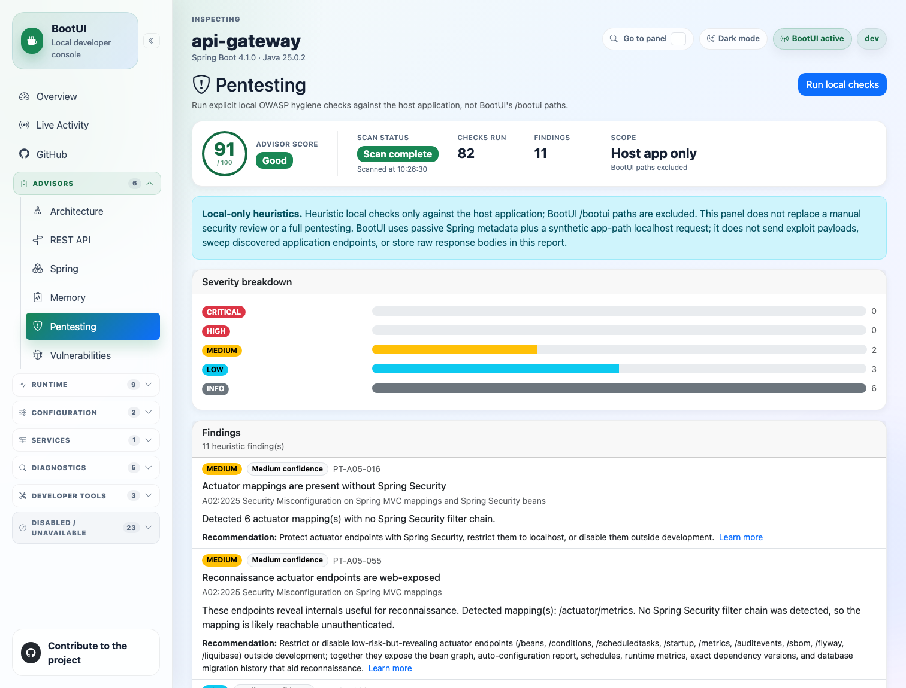
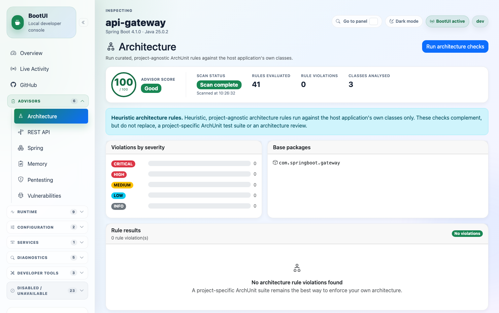
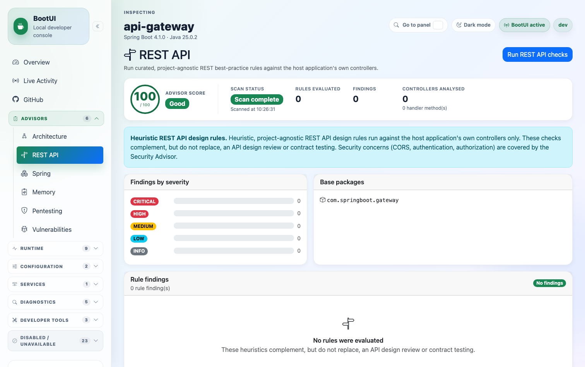
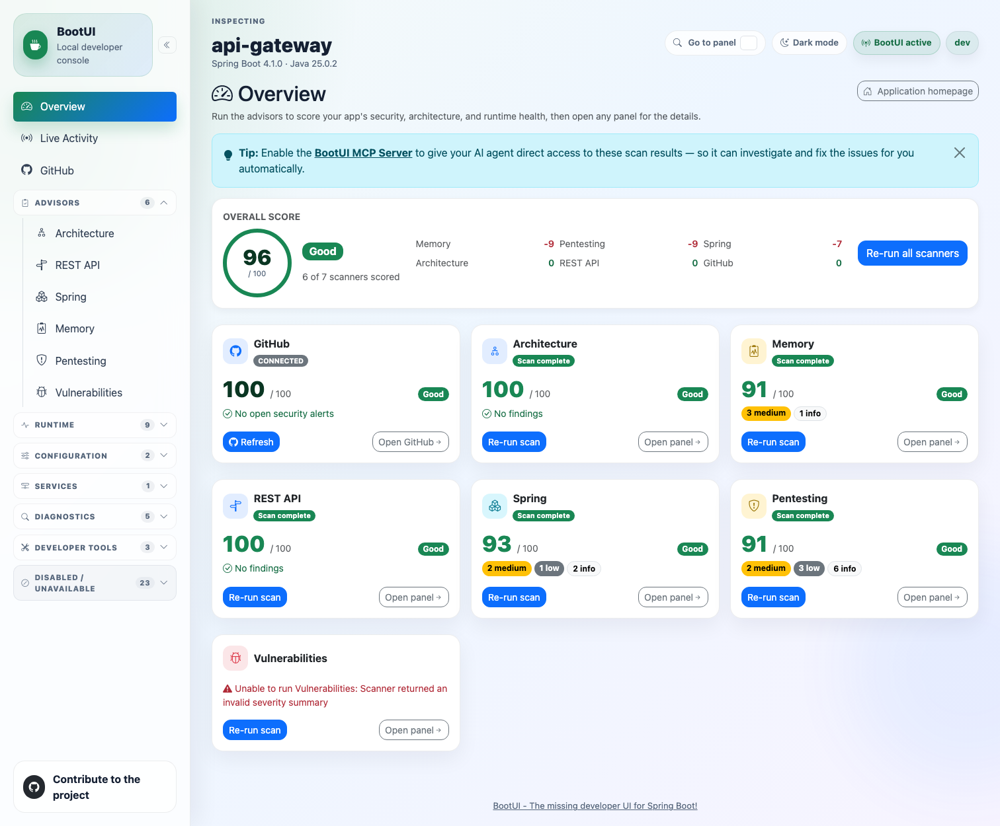
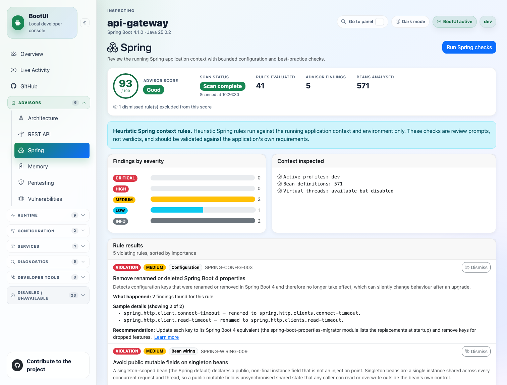
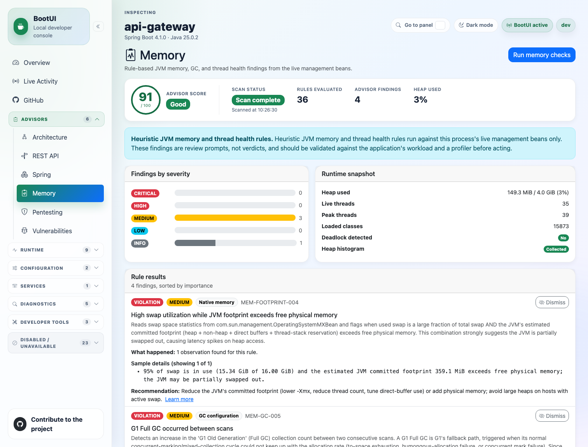
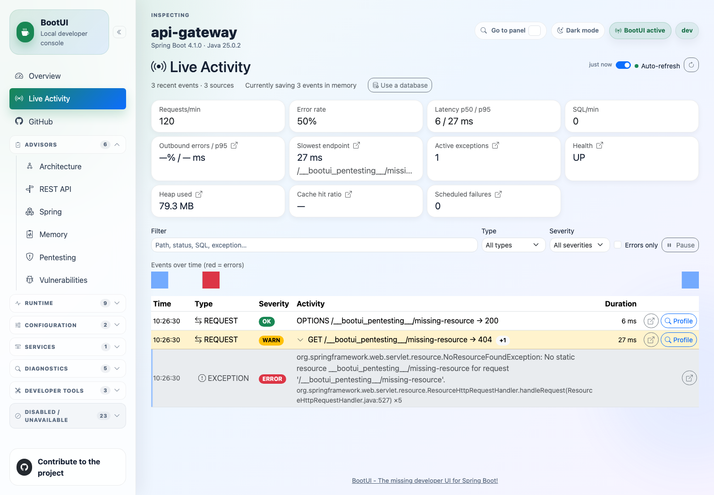
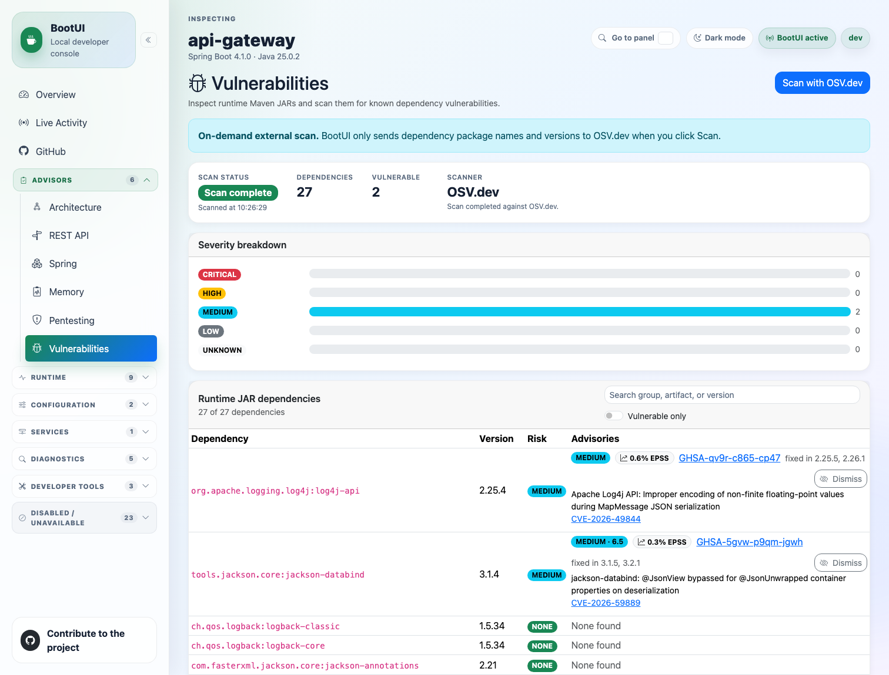
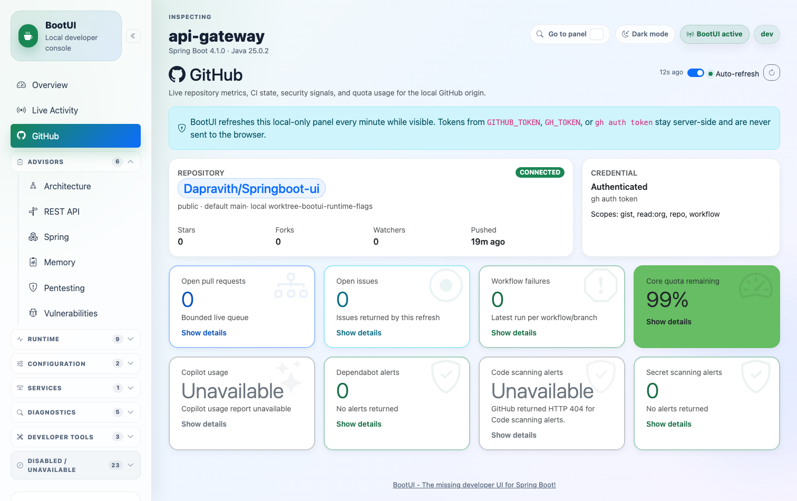

# Banking Microservices with BootUI

A local banking microservices environment built with Java 25, Spring Boot 4,
Gradle, PostgreSQL, Redis, Kafka, and Spring Cloud Gateway. Each runnable service
includes a development-only [BootUI](https://www.julien-dubois.com/boot-ui/)
diagnostics console.

> This project currently has no authentication layer. It is intended for local
> development only and must not be exposed to a public or shared network.

## Contents

- [System overview](#system-overview)
- [Prerequisites](#prerequisites)
- [Quick start](#quick-start)
- [Gradle commands](#gradle-commands)
- [Manual startup](#manual-startup)
- [Containerized startup](#containerized-startup)
- [Service URLs](#service-urls)
- [API smoke test](#api-smoke-test)
- [BootUI console](#bootui-console)
- [Configuration](#configuration)
- [Development workflow](#development-workflow)
- [Implementation guidelines](#implementation-guidelines)
- [Adding a new service](#adding-a-new-service)
- [Testing](#testing)
- [Production build](#production-build)
- [Stopping and cleaning](#stopping-and-cleaning)
- [Troubleshooting](#troubleshooting)
- [Further documentation](#further-documentation)
- [Security status](#security-status)
- [References](#references)

## System overview

The repository is a Gradle multi-project build. The Gradle wrapper exists only
at the repository root; individual service directories do not contain their own
`gradlew` files.

| Module | Port | Responsibility | Runtime dependencies |
|---|---:|---|---|
| `api-gateway` | 8080 | Routes business APIs to services | All application services |
| `customer-service` | 8081 | Customer registration and queries | PostgreSQL, Kafka |
| `account-service` | 8082 | Accounts, balances, and ledger updates | PostgreSQL, Redis, Kafka |
| `transfer-service` | 8083 | Transfer policy and orchestration | Account service |
| `notification-service` | 8084 | Consumes domain events and exposes recent notifications | Kafka |
| `common-domain` | — | Shared domain primitives and errors | None |
| `common-web` | — | API envelope and centralized error handling | `common-domain` |
| `common-audit` | — | Shared structured audit logging | `common-domain` |

Local infrastructure uses deliberately non-standard, loopback-only ports:

| Infrastructure | Host address | Purpose |
|---|---|---|
| PostgreSQL | `127.0.0.1:55432` | `customer_db` and `account_db` |
| Redis | `127.0.0.1:56379` | Non-critical account metrics |
| Kafka | `127.0.0.1:59092` | Customer and account domain events |

Repository layout:

```text
.
├── api-gateway/
├── customer-service/
├── account-service/
├── transfer-service/
├── notification-service/
├── common-domain/
├── common-web/
├── common-audit/
├── docker/
├── docs/
├── compose.yml            # PostgreSQL, Redis, and Kafka
├── compose.dev.yml        # Optional containerized application services
├── build.gradle           # Shared Gradle conventions
├── settings.gradle        # Module registration
├── gradlew                 # Run this wrapper from the repository root
└── run-all.sh              # Build and run the complete local system
```

## Prerequisites

Install the following before starting:

1. **JDK 25**
2. **Docker Desktop** or Docker Engine with the Compose plugin
3. **curl** for health checks and examples
4. At least **2 GB of free JVM heap** for the Gradle build

Verify the required tools:

```bash
java -version
docker --version
docker compose version
curl --version
```

The Java version should report 25. Start Docker Desktop before running the
project. On macOS:

```bash
open -a Docker
```

Wait until Docker reports that its engine is running:

```bash
docker info
```

## Quick start

Open a terminal and move to the repository root:

```bash
cd /path/to/BootUI
```

Run the complete system:

```bash
./run-all.sh
```

The script performs these steps:

1. Checks Java, curl, Docker, the Gradle wrapper, and ports 8080–8084.
2. Starts PostgreSQL, Redis, and Kafka from `compose.yml`.
3. Waits for the infrastructure health checks.
4. Runs `./gradlew clean build -Pdev` to compile and test every module.
5. Starts the five application JARs with the `dev` Spring profile and the BootUI
   runtime flags described in [BootUI console](#bootui-console).
6. Waits for every `/actuator/health` endpoint.
7. Keeps the services running until you press `Ctrl+C`.

Application logs are written separately under:

```text
logs/run-all/
```

Useful script options:

```bash
./run-all.sh --help
./run-all.sh --skip-build
./run-all.sh --skip-infra
./run-all.sh --stop-infra-on-exit
```

- `--skip-build` reuses existing JARs in each module's `build/libs` directory.
  Build those JARs with `-Pdev` first if BootUI is required.
- `--skip-infra` is only appropriate when compatible PostgreSQL, Redis, and
  Kafka instances are already available.
- `--stop-infra-on-exit` stops the Compose infrastructure when the script exits.

The script also accepts these environment variables:

| Variable | Default | Effect |
|---|---|---|
| `STARTUP_TIMEOUT` | `120` | Seconds to wait for each service to report healthy |
| `BOOTUI_MCP_ENABLED` | `ON` | Serves each service's BootUI MCP endpoint |
| `BOOTUI_READ_ONLY` | `false` | `false` unblocks the BootUI advisor scans |

Increase the service startup timeout when working on a slower machine:

```bash
STARTUP_TIMEOUT=180 ./run-all.sh
```

Restore BootUI's committed fail-safe defaults for a run:

```bash
BOOTUI_MCP_ENABLED=OFF BOOTUI_READ_ONLY=true ./run-all.sh
```

These two variables are runtime overrides passed as system properties to the
service JVMs. They do not change `application-dev.yml`, which keeps
`read-only: true` and `mcp.enabled: OFF`, so no other entry point inherits them.

## Gradle commands

Always run the wrapper from the repository root:

```bash
./gradlew tasks
./gradlew clean build
./gradlew clean build -Pdev
./gradlew test
```

Build or test one service:

```bash
./gradlew :customer-service:build
./gradlew :account-service:test
./gradlew :transfer-service:bootJar -Pdev
```

Build all runnable JARs:

```bash
./gradlew bootJar -Pdev
```

If the terminal is already inside a service directory, call the root wrapper
through the parent directory:

```bash
../gradlew build
```

Prefer running from the root with an explicit task path because it clearly
identifies the target module:

```bash
./gradlew :account-service:build
```

## Manual startup

Use this workflow when debugging services in separate terminals.

### 1. Start local infrastructure

```bash
docker compose -f compose.yml up -d --wait
```

Check its state:

```bash
docker compose -f compose.yml ps
```

### 2. Build the project

```bash
./gradlew clean build -Pdev
```

### 3. Run each service

Open a separate terminal for each command and execute it from the repository
root:

```bash
./gradlew :customer-service:bootRun -Pdev
```

```bash
./gradlew :account-service:bootRun -Pdev
```

```bash
./gradlew :transfer-service:bootRun -Pdev
```

```bash
./gradlew :notification-service:bootRun -Pdev
```

```bash
./gradlew :api-gateway:bootRun -Pdev
```

The `-Pdev` Gradle property attaches the BootUI runtime dependency and causes
`bootRun` to activate the `dev` Spring profile.

To run only one service, start its required infrastructure and execute only its
`bootRun` task. For example:

```bash
docker compose -f compose.yml up -d postgres kafka
./gradlew :customer-service:bootRun -Pdev
```

## Containerized startup

To run the application services as containers instead of host JVM processes:

```bash
./gradlew clean bootJar -Pdev
docker compose -f compose.yml -f compose.dev.yml up --build
```

The Docker images copy the JARs built by Gradle. The development overlay binds
all application ports to `127.0.0.1`, activates the `dev` profile, and connects
the services to their containerized dependencies.

Stop this stack with:

```bash
docker compose -f compose.yml -f compose.dev.yml down
```

## Service URLs

| Service | Business API | Health | BootUI |
|---|---|---|---|
| API gateway | `http://localhost:8080` | `http://localhost:8080/actuator/health` | `http://localhost:8080/bootui` |
| Customer | `http://localhost:8081/api/v1/customers` | `http://localhost:8081/actuator/health` | `http://localhost:8081/bootui` |
| Account | `http://localhost:8082/api/v1/accounts` | `http://localhost:8082/actuator/health` | `http://localhost:8082/bootui` |
| Transfer | `http://localhost:8083/api/v1/transfers` | `http://localhost:8083/actuator/health` | `http://localhost:8083/bootui` |
| Notification | `http://localhost:8084/api/v1/notifications` | `http://localhost:8084/actuator/health` | `http://localhost:8084/bootui` |

Business APIs can be called through the gateway on port 8080. Health and BootUI
URLs belong to the individual services and are intentionally not proxied by the
gateway. See [BootUI console](#bootui-console) for what each console offers.

Check all health endpoints:

```bash
for port in 8080 8081 8082 8083 8084; do
  curl --fail "http://localhost:${port}/actuator/health"
  echo
done
```

## API smoke test

The following examples use the gateway at `http://localhost:8080`.

### 1. Register a customer

```bash
curl --request POST \
  --header 'Content-Type: application/json' \
  --data '{"fullName":"Ada Lovelace","email":"ada@example.com"}' \
  http://localhost:8080/api/v1/customers
```

Copy `data.customerNumber` from the response. It has a format such as
`CUS0000000001`.

### 2. Open two accounts

Replace `CUS0000000001` with the customer number returned above:

```bash
curl --request POST \
  --header 'Content-Type: application/json' \
  --data '{"customerNumber":"CUS0000000001","openingBalance":1000.00,"currency":"USD"}' \
  http://localhost:8080/api/v1/accounts
```

```bash
curl --request POST \
  --header 'Content-Type: application/json' \
  --data '{"customerNumber":"CUS0000000001","openingBalance":100.00,"currency":"USD"}' \
  http://localhost:8080/api/v1/accounts
```

Copy each returned `data.accountNumber`.

### 3. Submit a transfer

Replace the sample account numbers with the two values returned above:

```bash
curl --request POST \
  --header 'Content-Type: application/json' \
  --data '{"fromAccountNumber":"ACC000000000001","toAccountNumber":"ACC000000000002","amount":25.00,"currency":"USD"}' \
  http://localhost:8080/api/v1/transfers
```

### 4. Inspect the result

```bash
curl http://localhost:8080/api/v1/accounts
curl http://localhost:8080/api/v1/transfers
curl http://localhost:8080/api/v1/notifications
```

Kafka delivery is asynchronous, so a notification may appear shortly after the
customer or account request completes.

## BootUI console

Each service embeds its own BootUI console at `/bootui`. There is no central
instance: a console can only inspect the JVM it runs inside, so open the console
that belongs to the service you are debugging.

```text
http://localhost:8080/bootui   api-gateway
http://localhost:8081/bootui   customer-service
http://localhost:8082/bootui   account-service
http://localhost:8083/bootui   transfer-service
http://localhost:8084/bootui   notification-service
```

The console header shows which application is being inspected, its Spring Boot
and Java versions, the active profile, and a `BootUI active` indicator.

### Enabling the panels

| Started with | BootUI attached | Advisor scans | MCP endpoint |
|---|---|---|---|
| `./run-all.sh` | Yes | Yes (`bootui.read-only=false`) | Yes (`bootui.mcp.enabled=ON`) |
| `bootRun -Pdev` | Yes | No — actions refused | No |
| `bootRun -Pdev` with overrides | Yes | Yes | Yes |
| Any build without `-Pdev` | No — `/bootui` returns 404 | — | — |

`run-all.sh` relaxes both settings so the console is usable immediately. A plain
`bootRun -Pdev` keeps the committed fail-safe defaults; add the overrides for a
single session when you need the scans:

```bash
./gradlew :account-service:bootRun -Pdev \
  --args='--bootui.read-only=false --bootui.mcp.enabled=ON'
```

Turning off read-only unblocks every action-capable panel in that process, not
only the scans. It is a per-run override — never commit `read-only: false`.

### Panels

The sidebar opens with Overview, Live Activity, and GitHub, then groups the rest:
**Advisors** (rule-based scans you trigger), **Runtime** (live views of the
process), followed by Configuration, Services, Diagnostics, Developer Tools, and
a Disabled / Unavailable group for panels this process cannot serve. The count
beside each group is computed from the running process, so a service's console
lists only the panels that apply to it.



*The Pentesting advisor on `api-gateway`. Every advisor follows this layout: a
score, the scan status and scope, a severity breakdown, then the findings with a
rule id and a recommendation.*

Advisors:

| Panel | What it reports |
|---|---|
| Architecture | Curated ArchUnit rules against the service's own classes. Reports rules evaluated, violations, and the base package scanned |
| REST API | REST design heuristics against the service's own controllers. The gateway analyses 0 controllers because it only routes |
| Spring | Bounded checks over the running context: renamed or removed Spring Boot 4 properties, bean-wiring problems, configuration smells |
| Memory | JVM memory, GC, and thread health read from the live management beans, plus a runtime snapshot (heap, live and peak threads, loaded classes, deadlocks) |
| Pentesting | Local OWASP hygiene checks against the host application only |
| Vulnerabilities | Runtime JAR inventory scanned against OSV.dev on demand |

<details>
<summary>Architecture and REST API panels on <code>api-gateway</code></summary>



*Architecture — 41 rules evaluated against the gateway's own classes, no
violations. The panel states that these heuristics complement rather than
replace a project-specific ArchUnit suite.*



*REST API — the gateway declares no controllers, so no rules are evaluated. On
`customer-service` or `account-service` this panel has controllers to analyse.*

</details>

Runtime: Health, HTTP Sessions, Metrics, Live Memory, JVM Tuning, Heap Dump,
Threads, GraalVM, and CRaC. These are live views and need no scan.

Every advisor states in the panel that its findings are **review prompts, not
verdicts**. Validate a finding against the code before acting on it, and treat
the heuristic rules as a complement to — not a replacement for — the project's
own ArchUnit suite, API review, and security review.

### Overview

The Overview page scores the app across the advisors and lets you run them all
with **Re-run all scanners**. Each card shows a per-advisor score, the severity
counts behind it, and its contribution to the overall score. The overall score
reports how many scanners it could include (for example "6 of 7 scanners
scored"); a scanner that failed to return a severity summary is excluded rather
than counted as zero.



*Overview on `api-gateway`. The Vulnerabilities card here shows the failure mode
described in [Troubleshooting](#overview-reports-unable-to-run-vulnerabilities):
the scanner returned no severity summary, so only 6 of 7 scanners were scored.*

Findings this project currently reports:

- **Spring** — `SPRING-CONFIG-003`: BootUI reports that Spring Boot 4 renamed
  `spring.http.client.connect-timeout` and `spring.http.client.read-timeout` to
  `spring.http.clients.*`, so the keys no longer take effect. `api-gateway`,
  `transfer-service`, and `account-service` all still set the old names, which
  means their outbound HTTP timeouts are not being applied. Also
  `SPRING-WIRING-009`, a public mutable field on a singleton bean.
- **Memory** — `MEM-FOOTPRINT-004`, high host swap usage while the JVM's
  committed footprint exceeds free physical memory; and `MEM-GC-005`, a G1 Full
  GC between two scans. Both are host-condition findings rather than defects.
- **Pentesting** — actuator mappings reachable without a Spring Security filter
  chain. See [Security status](#security-status): this project has no
  authentication layer, so these findings are expected until one is added.



*Spring — each violation carries a rule id, a category, sample details, and a
recommendation, and can be dismissed for the session.*



*Memory — the runtime snapshot on the right is read live from the management
beans, so it reflects the machine as well as the JVM.*

### Live Activity

Live Activity is the panel to keep open while exercising the APIs. It shows
requests per minute, error rate, latency p50/p95, SQL per minute, the slowest
endpoint, active exceptions, heap used, cache hit ratio, and scheduled failures,
above a filterable event stream of requests, SQL statements, and exceptions.
Auto-refresh can be paused, and events can be filtered by path, status, type, or
severity.



*Live Activity. The expanded row shows an exception with its stack frame and an
occurrence count, tied to the request that produced it.*

Events are held in memory by default, so they are lost when the service
restarts; the panel offers a database-backed store if you need them to survive a
restart.

### Vulnerabilities

**Scan with OSV.dev** sends the package names and versions of the runtime JARs
to `osv.dev` and lists each dependency with its advisories, severity, EPSS
score, and fixed versions. Nothing is sent until you click it. On a recent run
it inventoried 27 runtime dependencies and flagged two MEDIUM advisories
(`log4j-api` and `jackson-databind`) — re-run the scan rather than trusting that
snapshot.



*Vulnerabilities. Each row links the advisory and shows the versions that fix
it; the table can be filtered to vulnerable dependencies only.*

This and the GitHub panel are the only parts of BootUI that leave the machine.

### GitHub

The GitHub panel reads the local repository's origin and shows repository
metrics, open pull requests and issues, workflow failures, API quota, and
Dependabot, code-scanning, and secret-scanning alerts. It refreshes about once a
minute while visible.

It authenticates with `GITHUB_TOKEN`, `GH_TOKEN`, or an existing `gh auth token`.
The token is used server-side and is never sent to the browser. Panels that the
token's scopes or the repository plan do not cover render as `Unavailable`
rather than failing the page — code scanning on a repository without it returns
HTTP 404, for example.



*GitHub. The credential card confirms which token source was used and the scopes
it carries, which is what determines whether the cards below can populate.*

### MCP access for Claude Code

With `bootui.mcp.enabled=ON`, each service serves an MCP endpoint at
`http://127.0.0.1:<port>/bootui/api/mcp`, which lets Claude Code query the
running application directly instead of you reading panels by hand. Copy
`.mcp.json.example` to `.mcp.json` and keep only the services you are debugging;
`.mcp.json` is gitignored.

Each service is a separate MCP server on its own port — there is no aggregated
endpoint. Loopback clients need no token, so never put credentials in that file.

`docs/bootui-development.md` covers the tool list, the advisor-scan exception,
Docker behaviour, and the production restrictions in full.

## Configuration

Configuration is stored in each service under `src/main/resources`:

- `application.yml` contains shared defaults and local dependency addresses.
- `application-dev.yml` enables the local BootUI configuration.
- `application-prod.yml` explicitly disables BootUI as a safety backstop.

Important environment overrides:

| Variable | Used by | Default |
|---|---|---|
| `DB_URL` | Customer, account | Service-specific PostgreSQL JDBC URL |
| `DB_USERNAME` | Customer, account | `dev_user` |
| `DB_PASSWORD` | Customer, account | `dev_password` |
| `KAFKA_BOOTSTRAP_SERVERS` | Customer, account, notification | `localhost:59092` |
| `REDIS_HOST` | Account | `localhost` |
| `REDIS_PORT` | Account | `56379` |
| `ACCOUNT_SERVICE_URL` | Transfer, gateway | `http://localhost:8082` |
| `CUSTOMER_SERVICE_URL` | Gateway | `http://localhost:8081` |
| `TRANSFER_SERVICE_URL` | Gateway | `http://localhost:8083` |
| `NOTIFICATION_SERVICE_URL` | Gateway | `http://localhost:8084` |
| `AUDIT_ENABLED` | All services | `true` |
| `GITHUB_TOKEN` or `GH_TOKEN` | BootUI GitHub panel | Falls back to `gh auth token` |

Override a value for one run without editing committed configuration:

```bash
DB_URL='jdbc:postgresql://localhost:55432/customer_db' \
  ./gradlew :customer-service:bootRun -Pdev
```

Override a Spring property with `bootRun` arguments:

```bash
./gradlew :customer-service:bootRun -Pdev \
  --args='--server.port=18081'
```

Do not commit real credentials. Local `.env` files are ignored by Git.

## Development workflow

Use this sequence for normal feature work:

1. Start infrastructure with `docker compose -f compose.yml up -d --wait`.
2. Run the affected module's tests.
3. Implement the smallest complete change through the required architecture
   layers.
4. Run the affected service with `bootRun -Pdev`.
5. Exercise the endpoint through the gateway and watch the service's BootUI
   [Live Activity](#live-activity) panel.
6. Run `./gradlew test` to catch cross-module regressions.
7. Run `./gradlew clean build` before producing a production artifact.

Example inner loop for account-service:

```bash
./gradlew :account-service:test
./gradlew :account-service:bootRun -Pdev
```

Tail the structured audit logs while exercising APIs:

```bash
python3 scripts/tail-audit.py
```

See `docs/audit-logging.md` for filtering options and the event format.

## Implementation guidelines

Each business service follows Clean Architecture. Dependencies point inward:

```text
interfaces/rest ───────┐
                      v
infrastructure ──> application ──> domain
```

The domain must not depend on Spring, JPA, Kafka, Redis, Jackson, HTTP, or other
framework details.

### Implementing a new feature

Follow these steps in order:

1. **Define the domain behavior.** Add or update domain models, value objects,
   invariants, and domain exceptions under `domain/model`.
2. **Define inbound ports.** Add a use-case interface under `domain/port/in`.
   Commands should contain the values required by the use case, not web DTOs.
3. **Define outbound ports.** Add repository, event, clock, identity, or client
   interfaces under `domain/port/out` only when the use case needs external I/O.
4. **Implement orchestration.** Add an application service under `application`.
   It coordinates domain behavior and ports and owns transaction boundaries.
5. **Implement driven adapters.** Put JPA, Kafka, Redis, and HTTP client
   implementations under `infrastructure`. Keep framework annotations here.
6. **Implement the driving adapter.** Add the controller and request/response
   DTOs under `interfaces/rest`. Controllers translate wire formats and call
   inbound ports; they must not contain business rules or access repositories.
7. **Add configuration.** Register adapters through the service's configuration
   package and use environment-driven properties for external addresses and
   credentials.
8. **Add database migrations.** Put Flyway scripts under
   `src/main/resources/db/migration` using names such as
   `V2__add_transfer_status.sql`. Never use Hibernate schema updates.
9. **Add audit events.** Record important attempts, successes, and failures at
   the application boundary. Follow `docs/audit-logging.md`.
10. **Test from the inside out.** Test domain invariants first, then application
    behavior with fakes, adapter mapping, validation, and architecture rules.
11. **Run the service locally.** Use `bootRun -Pdev`, verify its health endpoint,
    call the API, and inspect BootUI and logs.
12. **Run the complete build.** Execute `./gradlew clean build` before handing
    off the change.

### Layer rules

- Domain classes must remain plain Java.
- Application services depend on port interfaces, not concrete adapters.
- Controllers depend on inbound ports, never persistence implementations.
- Persistence entities stay inside their infrastructure package and are mapped
  explicitly to domain objects.
- Request and response DTOs are separate from domain models.
- Shared code belongs in a common module only when multiple services genuinely
  share the same stable concept.
- A service owns its data. Do not query another service's database directly.
- Cross-service synchronous calls require explicit timeouts.
- Kafka consumers must be idempotent because messages can be delivered again.
- Never log passwords, tokens, full credentials, or unmasked personal data.

### Database changes

Flyway owns relational schemas and Hibernate validates them at startup.

1. Add a new forward-only migration instead of editing a migration already used
   by another developer or environment.
2. Keep a service's schema changes within that service.
3. Update the JPA entity and mapper explicitly.
4. Add repository or integration coverage for the new behavior.
5. Start against an existing local database to confirm that migration from the
   previous schema succeeds.

### API changes

- Keep endpoints under `/api/v1/<resource>`.
- Use Jakarta validation on HTTP request DTOs.
- Return the shared `ApiResponse<T>` envelope.
- Let `GlobalExceptionHandler` produce consistent errors; do not duplicate
  exception mapping in controllers.
- Add the gateway route when introducing a new business API prefix.
- Treat incompatible request or response changes as a new API version.

## Adding a new service

Use the following checklist when creating another deployable service:

1. Create `<name>-service/` at the repository root.
2. Add `include '<name>-service'` to `settings.gradle`.
3. Add a module `build.gradle` applying the Spring Boot and dependency-management
   plugins.
4. Add explicit dependencies on only the common modules the service needs.
5. Create the package root `com.springboot.<name>` with `domain`, `application`,
   `infrastructure`, and `interfaces/rest` packages.
6. Add a Spring Boot application class.
7. Add `application.yml`, `application-dev.yml`, and `application-prod.yml`.
8. Allocate a unique server port and document it in this README.
9. Copy an existing `ArchitectureTest`, change its base package, and keep the
   test non-vacuous.
10. If persistence is needed, add a service-owned database, Flyway migrations,
    Compose configuration, and environment variables.
11. If messaging is needed, document the topic, payload contract, producer, and
    consumer ownership.
12. Add the service's route to `api-gateway/src/main/resources/application.yml`.
13. Add the service and port to the `SERVICES` and `PORTS` arrays in
    `run-all.sh`.
14. Add the container definition to `compose.dev.yml` when containerized local
    execution is required.
15. Run the module tests, the architecture test, and the complete build.

The root build automatically attaches BootUI to modules applying the Spring
Boot plugin, but only when Gradle is invoked with `-Pdev`.

## Testing

Run the complete test suite:

```bash
./gradlew test
```

Run one module:

```bash
./gradlew :customer-service:test
```

Run one test class:

```bash
./gradlew :account-service:test --tests '*AccountTest'
```

Run architecture enforcement:

```bash
./gradlew :account-service:test --tests '*ArchitectureTest'
./gradlew :customer-service:test --tests '*ArchitectureTest'
```

Run a clean verification build:

```bash
./gradlew clean build
```

Gradle parallel execution and build caching are enabled in `gradle.properties`.

## Production build

Developer build with BootUI attached:

```bash
./gradlew clean build -Pdev
```

Production build without BootUI:

```bash
./gradlew clean build
```

Confirm the current Gradle invocation mode:

```bash
./gradlew bootuiStatus
./gradlew bootuiStatus -Pdev
```

Verify that a production JAR does not contain BootUI:

```bash
unzip -l account-service/build/libs/account-service-0.0.1-SNAPSHOT.jar \
  | grep -c bootui
```

The expected count is `0`. A production artifact containing BootUI is a release
blocker.

## Stopping and cleaning

When using `run-all.sh`, press `Ctrl+C` to stop all application JVMs.

Stop infrastructure while preserving database and Kafka volumes:

```bash
docker compose -f compose.yml stop
```

Stop and remove infrastructure containers while preserving named volumes:

```bash
docker compose -f compose.yml down
```

Remove Gradle build outputs:

```bash
./gradlew clean
```

To completely reset local PostgreSQL and Kafka data, remove the named volumes:

```bash
docker compose -f compose.yml down --volumes
```

> Warning: `down --volumes` permanently deletes the local databases and Kafka
> data for this Compose project.

## Troubleshooting

### `zsh: no such file or directory: ./gradlew`

The command is being run outside the repository root or from inside a service
directory. Use:

```bash
cd /path/to/BootUI
./gradlew build
```

From a service directory, use `../gradlew`, although root task paths are clearer.

### `Permission denied: ./gradlew`

Restore executable permission:

```bash
chmod +x gradlew run-all.sh
```

### `Docker is not running`

Start Docker Desktop, wait for its engine, and retry:

```bash
open -a Docker
docker info
./run-all.sh
```

### A port is already in use

Identify the process on a service port:

```bash
lsof -nP -iTCP:8081 -sTCP:LISTEN
```

Stop the existing process or override the port for a manual run:

```bash
./gradlew :customer-service:bootRun -Pdev \
  --args='--server.port=18081'
```

When changing a service port, also update the corresponding gateway URL for
that run.

### PostgreSQL connection or Hibernate dialect error

Confirm PostgreSQL is healthy:

```bash
docker compose -f compose.yml ps postgres
docker compose -f compose.yml logs postgres
```

The default host URL is `jdbc:postgresql://localhost:55432/<database>`.

### Service does not become healthy

Inspect its dedicated startup log:

```bash
tail -n 100 logs/run-all/customer-service.log
```

Also check infrastructure:

```bash
docker compose -f compose.yml ps
docker compose -f compose.yml logs --tail=100
```

### `/bootui` returns 404

The service was built or started without `-Pdev`. Verify developer mode:

```bash
./gradlew bootuiStatus -Pdev
```

Then rebuild and run the service with `-Pdev`.

### `/bootui` returns 403

Use `localhost` or `127.0.0.1`. BootUI intentionally rejects non-loopback
clients by default.

### A BootUI panel or scan returns "BootUI is read-only"

Expected when the service was started with `bootRun -Pdev`, which keeps the
committed default `bootui.read-only: true`. Add the override for that run:

```bash
./gradlew :account-service:bootRun -Pdev \
  --args='--bootui.read-only=false'
```

`run-all.sh` already sets it. Do not commit `bootui.read-only=false`; see
`docs/bootui-development.md` for the rationale.

### Overview reports "Unable to run Vulnerabilities"

The Overview aggregate could not score that scanner, which is why it reports
scoring fewer scanners than it lists. Open the Vulnerabilities panel and run
**Scan with OSV.dev** directly — the panel reports the dependency inventory and
advisories even when the aggregate card cannot summarise them.

### Live Activity shows 404s for `__bootui_pentesting__`

These are BootUI's own synthetic probe requests from the Pentesting advisor, not
a broken route. The advisor sends one localhost request against an application
path to test error handling; the resulting 404 and `NoResourceFoundException`
are the expected outcome.

### The GitHub panel shows "Unavailable"

No token was found, or the token's scopes and the repository's plan do not cover
that metric. Export `GITHUB_TOKEN`/`GH_TOKEN` or sign in with `gh auth login`,
then restart the service. Code scanning returns HTTP 404 on repositories that do
not have it enabled, which the panel reports as unavailable rather than as an
error.

### Gradle cannot find Java 25

Confirm the active JDK:

```bash
java -version
/usr/libexec/java_home -V
```

On macOS, select JDK 25 for the current terminal:

```bash
export JAVA_HOME="$(/usr/libexec/java_home -v 25)"
```

## Further documentation

- [`docs/architecture.md`](docs/architecture.md) — dependency rules, service
  structure, shared modules, and reliability decisions.
- [`docs/bootui-development.md`](docs/bootui-development.md) — BootUI profiles,
  Docker behavior, MCP usage, security controls, and production restrictions.
- [`docs/audit-logging.md`](docs/audit-logging.md) — audit format, configuration,
  actor limitations, and implementation guidance.

## References

- [BootUI — Spring Boot application management and monitoring](https://www.julien-dubois.com/boot-ui/)

## Security status

There is no Spring Security configuration in this project. Business endpoints
and exposed actuator endpoints are unauthenticated. Keep all ports bound to
localhost, never route BootUI through an ingress or public gateway, never commit
credentials, and do not deploy this system beyond a developer machine until an
authentication and authorization design has been implemented. BootUI's
Pentesting advisor reports this gap, and its findings there are correct.

Two BootUI panels reach outside the machine, both only in developer mode:
Vulnerabilities sends dependency names and versions to OSV.dev when you click
**Scan with OSV.dev**, and the GitHub panel calls the GitHub API with a
server-side token. Neither runs in a production build, because BootUI is not on
a production classpath at all.
